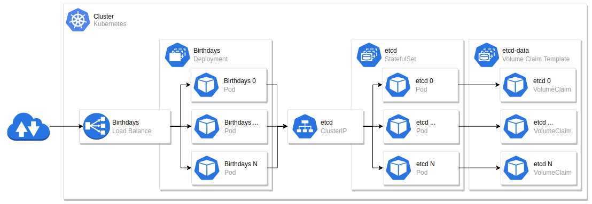

**Birthdays** is a web service that stores the birthday date of users and calculates the remaining days until the user's birthday.

## Features
- Metrics service exposes both service usage and system status
- Custom listen ports for Birthdays service and Metrics service
- Custom limit of concurrent request handlers
- Custom timeout
- Pluggable persistence modules
- Settings via command line arguments or environment variables (BIRTHDAYS_ prefix)

## Functionality
This application exploses the following HTTP-based APIs:

```bash
Description: Saves/updates the given user’s name and date of birth in the database.
Request: PUT /hello/<username> { “dateOfBirth”: “YYYY-MM-DD” }
Response: 204 No Content
```

```bash
Description: Returns hello birthday message for the given user
Request: Get /hello/<username>
Response: 200 OK
Response Examples:
A. If username’s birthday is in N days:
{ “message”: “Hello, <username>! Your birthday is in N day(s)”}
B. If username’s birthday is today:
{ “message”: “Hello, <username>! Happy birthday!” }
```

Prometheus metrics available via endpoint **/metrics:${BIRTHDAYS_Metrics}** (default BIRTHDAYS_Metrics port 9095)

## Architecture

Birthdays deployed in a Kubernetes Cluster:


## Table of Contents

- [Build and run Birthdays](#build-and-run-birthdays)
- [Build docker images](#build-docker-images)
- [Kubernetes deployment](#kubernetes-deployment)
- [AWS ECS deployment](#aws-ecs-deployment)


## Build and run Birthdays

Requirements:

- **[Build]** [Golang](https://golang.org/) - [go1.16](https://golang.org/dl/)
- **[Run]** [etcd](https://etcd.io/) - [v3.5](https://etcd.io/docs/v3.5/install/)

Compile and install:

```bash
$ go clean . && go build .
```

Run Unit Tests:

```bash
$ go clean . && go test . -v
```

Start Birthdays service:

```bash
$ ./birthdays
```

Birthdays service settings:

```bash
$ ./birthdays --help

Usage: birthdays [FLAG]...

Flags:
    --listen                 Service listen address.                                 (type: string; env: BIRTHDAYS_Listen; default: :8080)
    --workers                Number of serving workers.                              (type: uint8; env: BIRTHDAYS_Workers; default: 2)
    --timeout                Maximum time (in milliseconds) to wait for a worker.    (type: uint64; env: BIRTHDAYS_Timeout; default: 1000)
    --metrics                Metrics listen address.                                 (type: string; env: BIRTHDAYS_Metrics; default: :9095)
    --persistence-plugin     Persistence plugin                                      (type: string; env: BIRTHDAYS_PersistencePlugin; default: persistence_etcd.so)
    --persistence-options    Persistence options                                     (type: string; env: BIRTHDAYS_PersistenceOptions; default: { "endpoints": "localhost:2379", "path": "/users" })
    -h, --help               show help                                               (type: bool)
```

## Build docker images

This builds the docker image xboshy/birthdays:0.1.0 using a multi-stage build

```bash
$ docker build -t xboshy/birthdays:0.1.0 .
```

Launching a container

```bash
$ docker run -e BIRTHDAYS_Listen=8080 -e BIRTHDAYS_Metrics=9095 -e BIRTHDAYS_PersistenceOptions='{ "endpoints": "etcd.host:2379", "path": "/users" }' -p 8080:8080 -p 9095:9095 xboshy/birthdays:0.1.0
```

Simple request scripts

```bash
$ ./tools/put.sh <birthdays-service-address> <username> <dateOfBirth>
```
```bash
$ ./tools/get.sh <birthdays-service-address> <username>
```

Examples:

```bash
$ ./tools/put.sh http://172.18.255.1:8080/hello revolut '2015-07-01'
*   Trying 172.18.255.1:8080...
* Connected to 172.18.255.1 (172.18.255.1) port 8080 (#0)
> PUT /hello/revolut HTTP/1.1
> Host: 172.18.255.1:8080
> User-Agent: curl/7.79.1
> Accept: */*
> Content-Type: application/json
> Content-Length: 29
> 
* Mark bundle as not supporting multiuse
< HTTP/1.1 204 No Content
< Date: Sun, 15 Oct 2021 20:30:37 GMT
< 
* Connection #0 to host 172.18.255.1 left intact
```

```bash
./tools/get.sh http://172.18.255.1:8080/hello xboshy

*   Trying 172.18.255.1:8080...
* Connected to 172.18.255.1 (172.18.255.1) port 8080 (#0)
> GET /hello/revolut HTTP/1.1
> Host: 172.18.255.1:8080
> User-Agent: curl/7.79.1
> Accept: */*
> 
* Mark bundle as not supporting multiuse
< HTTP/1.1 200 OK
< Date: Sun, 15 Oct 2021 20:30:46 GMT
< Content-Length: 63
< Content-Type: text/plain; charset=utf-8
< 
* Connection #0 to host 172.18.255.1 left intact
{ "message": "Hello, revolut! Your birthday is in 259 day(s)" }
```

## Kubernetes deployment

Image should be available in your cluster.

[Kind](https://kind.sigs.k8s.io/) example:

```bash
kind load docker-image xboshy/birthdays:0.1.0
```

Deploying the Birthdays service:

```bash
# skip etcd deployment if you prefer to use an already existing etcd cluster
# you you skip etcd deployment, reflect the etcd configuration on deployment/birthdays.yaml
kubectl apply -f deployment/etcd.yaml
kubectl apply -f deployment/birthdays.yaml
```

Deploying the Prometheus with service discovery:

```bash
kubectl apply -f deployment/prometheus-rbac.yaml
kubectl apply -f deployment/prometheus.yaml
```

## AWS EKS deployment

[Optional] Use eksctl for cluster deploying:
```bash
ssh-keygen -t rsa -b 4096 -f aws-eks-key
eksctl create cluster --config-file deployment/aws-eks-cluster.yaml
```

With aws-cli and eksctl installed, use the same deployment steps described in [Kubernetes deployment](kubernetes-deployment).
